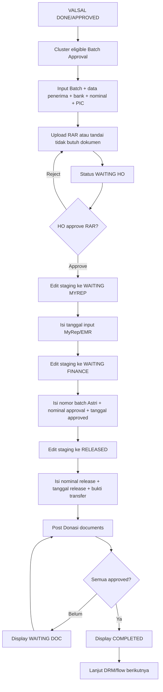

# Analisa Modul Batch Approval MyRep

## Ringkasan

`Batch_Approval_MyRep` adalah modul transisi setelah `VALSAL_MyRep` selesai dan sebelum masuk tahap `DRM_MyRep`. Modul ini mengelola pengajuan donasi cluster MyRep, upload dokumen RAR, approval dokumen oleh HO/Super Admin, staging approval ke pihak MyRep/EMR dan Finance, bukti transfer, serta monitoring kelengkapan dokumen Post Donasi.

Komponen utama:

- Controller: `application/controllers/Batch_Approval_MyRep.php`
- Model: `application/models/MBatch_Approval_MyRep.php`
- View daftar: `application/views/Batch_Approval_MyRep/index.php`
- View detail: `application/views/Batch_Approval_MyRep/detail.php`
- Upload RAR: `uploads/myrep_batch_approval/`
- Upload bukti transfer: `uploads/myrep_batch_transfer/`

## Posisi Dalam Flow MyRep

Flow ringkas:

1. `BAK_MyRep` selesai.
2. `VALSAL_MyRep` selesai dengan `status_valsal` `DONE` atau `APPROVED`.
3. Cluster muncul sebagai kandidat di `Batch_Approval_MyRep`.
4. User input data batch approval dan upload RAR.
5. HO/Super Admin review dokumen RAR.
6. Staging bergerak dari `WAITING HO` ke `WAITING MYREP`, lalu `WAITING FINANCE`, lalu `RELEASED`.
7. Setelah release, modul menampilkan kebutuhan dokumen `POST_DONASI`.
8. Jika semua dokumen Post Donasi approved, display status menjadi `COMPLETED`.
9. Setelah completed, cluster dapat lanjut ke flow berikutnya seperti `DRM_MyRep`.

## Hak Akses

Modul memakai `Myrep_access_service`.

- Saat controller dibuat, user login dicek dengan `enforceView('Batch_Approval_MyRep')`.
- Aksi per method dicek lewat `enforceByMethod`.
- Permission UI memakai action `TAMBAH`, `EDIT`, `HAPUS`, dan `APPROVAL`.
- Approver hard rule: user dengan `lokasi_user = HO` atau `nama_level = Super Admin`.
- User non Admin/Super Admin dibatasi berdasarkan city mapping di `tb_myrep_pic_mapping_city`.

## Halaman Daftar

Endpoint:

```text
GET /Batch_Approval_MyRep
```

Fitur:

- Filter kota dan status.
- Summary:
  - `NY Batch`: cluster VALSAL yang belum dibuat batch.
  - `On Proses`: batch belum completed/rejected.
  - `Done`: batch completed dan belum lanjut ke status post-batch.
  - `Rejected`: batch atau cluster rejected.
- Dua tabel:
  - `table_batch_ny_drm`: data yang belum lanjut ke DRM/RFS/ATP/DONE.
  - `table_batch_all`: seluruh data sesuai filter.
- Input Batch manual.
- Import Batch Excel/CSV.
- Download report CSV.
- Upload/review dokumen RAR dari list.
- Upload bukti transfer.
- Hapus cluster beserta flow terkait.

## Halaman Detail

Endpoint:

```text
GET /Batch_Approval_MyRep/detail/{cluster_id}
```

Fitur:

- Informasi cluster dan data batch.
- Progress bar staging.
- Edit batch approval.
- Upload/lihat RAR.
- Approve/reject RAR.
- History dokumen RAR.
- Edit staging ke tahap berikutnya.
- Upload bukti transfer saat release.
- Tabel dokumen Post Donasi.
- Bulk upload Post Donasi.
- Approve/reject dokumen Post Donasi lewat controller `Post_Donasi_MyRep`.

## Status Batch

Status internal disimpan di `tb_myrep_batch_approval.staging_status`.

| Status | Arti | Catatan |
| --- | --- | --- |
| `DRAFT` | Status draft/import awal | Bisa muncul dari import |
| `WAITING HO` | Batch baru masuk dan menunggu HO | Default saat input manual |
| `WAITING MYREP` | Sudah dikirim/input ke MyRep/EMR | Label UI sebagian menampilkan `WAITING EMR` |
| `WAITING FINANCE` | Sudah approved MyRep/EMR dan menunggu finance | Butuh nomor batch dan nominal nego |
| `RELEASED` | Dana sudah dicairkan | Butuh tanggal release, nominal release, bukti transfer |
| `DONE BATCH APPROVAL` | Status selesai eksplisit | Bisa dipakai dari edit/import |
| `REJECTED` | Batch ditolak | Dokumen reject juga memicu email queue |
| `WAITING DOC` | Display status turunan | Muncul jika release/done tetapi dokumen Post Donasi belum lengkap |
| `COMPLETED` | Display status turunan | Muncul jika semua dokumen Post Donasi sudah approved |

`status_current` di `tb_myrep_cluster` mengikuti staging lewat mapping sederhana. Jika existing cluster sudah masuk `DRM`, `RFS`, `ATP`, atau `DONE`, model menjaga agar status tersebut tidak ditimpa saat update batch.

## Flow Kerja Manual

1. User membuka halaman daftar.
2. Sistem mengambil kandidat dari cluster yang:
   - punya `tb_myrep_valsal`;
   - `status_valsal` `DONE` atau `APPROVED`;
   - `tb_myrep_cluster.status_current = VALSAL`;
   - belum punya record batch approval.
3. User klik `Input Batch`.
4. User mengisi:
   - cluster;
   - tanggal submission;
   - HP donasi;
   - nominal pengajuan area;
   - data penerima;
   - data bank;
   - optional free wifi;
   - optional PIC tambahan, maksimal 5;
   - upload RAR atau centang dokumen tidak dibutuhkan.
5. Controller membuat record `tb_myrep_batch_approval`.
6. Controller membuat/mengganti PIC di `tb_myrep_batch_approval_pic`.
7. Controller update `tb_myrep_cluster.status_current` menjadi `WAITING HO`.
8. Jika tabel dokumen tersedia, controller menyimpan RAR ke flow dokumen `BATCH_APPROVAL` group `RAR`.
9. Sistem mengirim notifikasi event `cluster_masuk`.

## Flow Review RAR

1. User upload RAR melalui `uploadDocument`.
2. File disimpan ke `uploads/myrep_batch_approval/`.
3. Record masuk/replace di `tb_myrep_flow_doc_file`.
4. Status file menjadi `UPLOADED`, yang di UI ditampilkan sebagai `ON REVIEW`.
5. Log dibuat di `tb_myrep_flow_doc_file_log` dengan action `UPLOAD` atau `REUPLOAD`.
6. HO/Super Admin melakukan approve atau reject.
7. Approve mengubah `status_file = APPROVED` dan mengisi `approved_at`.
8. Reject mengubah `status_file = REJECTED`, membuat log, dan enqueue email reject.
9. Package status direfresh:
   - tidak ada file: `NOT STARTED`;
   - ada file belum semua approved: `ON PROGRESS`;
   - semua approved: `DONE`.

Catatan penting: upload RAR awal di input manual mengizinkan `pdf|doc|docx|xls|xlsx|jpg|jpeg|png|rar|zip`, tetapi endpoint upload ulang `uploadDocument` hanya mengizinkan `pdf|doc|docx|xls|xlsx|jpg|jpeg|png`. Ini inkonsisten jika user perlu re-upload RAR/ZIP.

## Flow Staging

Staging hanya dapat diubah oleh HO/Super Admin.

1. `WAITING HO` ke `WAITING MYREP`
   - Wajib isi tanggal input ke MyRep/EMR (`submitted_to_astri_at`).
2. `WAITING MYREP` ke `WAITING FINANCE`
   - Wajib isi nomor batch Astri.
   - Wajib isi nominal approval MyRep/EMR (`nominal_nego_emr`).
   - Wajib isi tanggal approved MyRep/EMR (`submitted_to_finance_at`).
3. `WAITING FINANCE` ke `RELEASED`
   - Wajib isi tanggal pencairan (`released_at`).
   - Wajib isi nominal release finance.
   - Wajib upload bukti transfer.
   - File disimpan ke `uploads/myrep_batch_transfer/`.

Transisi selain urutan di atas ditolak oleh controller `updateStagingProgress`.

## Flow Post Donasi

Setelah Batch Approval release/done, halaman detail menampilkan dokumen Post Donasi dari `MPost_Donasi_MyRep`.

Beberapa dokumen Post Donasi dapat auto-linked dari dokumen tahap sebelumnya:

| Dokumen Post Donasi | Source Flow | Source Group | Source Dokumen |
| --- | --- | --- | --- |
| `SURAT IJIN RT / RW` | `BAK` | `BA OPEN` | `Surat Ijin` |
| `FORM CLUSTER SURVEY` | `BAK` | `BA OPEN` | `Form Survey` |
| `LAYOUT SND KASAR` | `VALSAL` | `VALIDASI SALES` | `SND Kasar` |

Jika dokumen Post Donasi sudah lengkap approved, display status menjadi `COMPLETED`. Jika belum, display status menjadi `WAITING DOC`.

## Endpoint

| Method | URL | Fungsi |
| --- | --- | --- |
| GET | `/Batch_Approval_MyRep` | Halaman daftar |
| GET | `/Batch_Approval_MyRep/detail/{cluster_id}` | Halaman detail |
| GET | `/Batch_Approval_MyRep/downloadReport` | Export CSV report |
| POST | `/Batch_Approval_MyRep/saveBatchApproval` | Simpan input batch manual |
| POST | `/Batch_Approval_MyRep/updateBatchApproval` | Edit data batch |
| POST | `/Batch_Approval_MyRep/uploadDocument` | Upload/reupload RAR atau tandai tidak butuh dokumen |
| POST | `/Batch_Approval_MyRep/uploadTransferProof` | Upload bukti transfer dan set release |
| POST | `/Batch_Approval_MyRep/updateStagingProgress` | Ubah staging sesuai urutan |
| POST | `/Batch_Approval_MyRep/approveDocument` | Approve RAR |
| POST | `/Batch_Approval_MyRep/rejectDocument` | Reject RAR |
| GET | `/Batch_Approval_MyRep/previewDocument/{id_doc_file}` | Preview file RAR inline |
| GET | `/Batch_Approval_MyRep/downloadBatchImportTemplate` | Download template import |
| POST | `/Batch_Approval_MyRep/previewBatchImport` | Preview validasi import Excel/CSV |
| POST | `/Batch_Approval_MyRep/saveImportedBatch` | Simpan hasil import valid |
| POST | `/Batch_Approval_MyRep/deleteCluster` | Hapus cluster dan semua flow terkait via cleanup model |

## Struktur Data Utama

### `tb_myrep_batch_approval`

Menyimpan header batch:

- `id_batch_approval`
- `id_myrep_cluster`
- `submission_date`
- `hp_donasi`
- `nominal_pengajuan_area`
- `nominal_nego_emr`
- `nominal_release_finance`
- `nominal_per_homepass`
- `bank_name`
- `bank_account_number`
- `recipient_name`
- `recipient_phone`
- `recipient_position`
- `recipient_period`
- `free_wifi_qty`
- `free_wifi_period_month`
- `astri_batch_number`
- `staging_status`
- `submitted_to_ho_at`
- `submitted_to_astri_at`
- `submitted_to_finance_at`
- `released_at`
- `transfer_proof_file_name`
- `transfer_proof_file_path`
- `remark_batch_approval`
- audit columns `created_by`, `updated_by`, `created_at`, `updated_at`

### `tb_myrep_batch_approval_pic`

Menyimpan PIC penerima/donasi:

- `id_batch_pic`
- `id_batch_approval`
- `pic_no`
- `pic_name`
- `pic_phone`
- `pic_position`
- `pic_period`
- `is_primary`
- audit timestamp

### Tabel dokumen generik

- `md_myrep_flow_doc_group`
- `md_myrep_flow_doc_item`
- `tb_myrep_flow_doc_package`
- `tb_myrep_flow_doc_file`
- `tb_myrep_flow_doc_file_log`

Konfigurasi batch memakai:

- `flow_type = BATCH_APPROVAL`
- `group_label = RAR`
- `doc_name = RAR`

## Import Batch

Import menerima file `xls`, `xlsx`, atau `csv`.

Kolom template:

```text
cluster_id, id_target, city_name, cluster_name, cluster_code,
homepass_valsal, valsal_date, status_valsal, remark_valsal,
hp_donasi, nominal_pengajuan_area, nominal_nego_emr,
nominal_release_finance, submission_date, staging_status,
astri_batch_number, recipient_name, recipient_phone,
recipient_position, recipient_period, bank_name,
bank_account_number, free_wifi_qty, free_wifi_period_month,
remark_batch_approval, pic_name, pic_phone, pic_position, pic_period
```

Validasi import:

- Cluster dicari dari `cluster_id`, lalu fallback ke `cluster_name` + `city_name`/`id_target`.
- Jika cluster belum ada, sistem dapat membuat cluster baru berdasarkan target kota.
- `homepass_valsal`, `hp_donasi`, dan `nominal_pengajuan_area` wajib lebih dari 0.
- `recipient_name`, `bank_name`, dan `bank_account_number` wajib diisi.
- Jika cluster sudah punya batch approval, row ditolak.
- Import juga melakukan upsert BAK DONE dan VALSAL DONE sebelum membuat batch.

## Report CSV

Endpoint report menerima filter:

- `city` atau `city[]`
- `regional` atau `regional[]`
- `status`
- `submission_date_start`
- `submission_date_end`

Kolom export:

- Cluster
- Kode Cluster
- Regional
- Kota
- Periode Target
- Tanggal Submission
- HP Donasi
- Nominal Pengajuan Area
- Nominal Nego EMR
- Nominal Release Finance
- Staging Status
- Status Flow
- Nomor Batch Astri
- Remark Batch Approval

## SLA

UI menghitung SLA 5 hari kerja.

- Start date memakai `approved_at` dari dokumen VALSAL default: `SND Kasar`, `Form SND`, atau `Boundary KMZ`.
- Jika tidak ada approved date, fallback ke `valsal_date`.
- End date memakai `submitted_to_finance_at` jika ada, jika belum memakai tanggal hari ini.
- Aging lebih dari 5 hari kerja diberi badge danger.

## Catatan Risiko dan Temuan

1. Validasi urutan staging ada di controller, tetapi edit umum `updateBatchApproval` tetap menerima `staging_status` dari form. Ini dapat membuka perubahan status langsung jika permission edit diberikan luas.
2. Upload awal RAR mengizinkan `rar|zip`, sedangkan reupload lewat `uploadDocument` tidak. Ini rawan membingungkan user.
3. `is_document_not_required` tetap disimpan dengan `status_file = UPLOADED`, sehingga masih perlu review HO. Secara proses ini masuk akal, tetapi label bisnisnya perlu disepakati.
4. Permission approver menggunakan dua lapis: service permission dan hard check HO/Super Admin. Pastikan konfigurasi UI dan backend selaras agar tombol tidak muncul untuk user yang akhirnya ditolak backend.
5. `deleteCluster` menghapus seluruh cluster dan semua flow terkait, bukan hanya batch approval. Tombol ini berisiko tinggi dan perlu dibatasi ketat.

## Mermaid Flow


