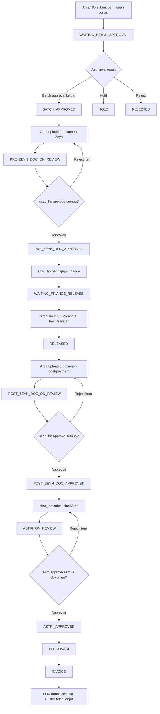

# Requirement Flow Baru Batch Approval MyRep

## Keputusan Utama

Flow ini akan menggantikan `Batch_Approval_MyRep` existing. Semua cluster MyRep ke depan wajib menggunakan flow donasi ini, tetapi selesainya invoice donasi tidak menghentikan lifecycle cluster. Cluster tetap lanjut ke flow MyRep berikutnya karena donasi adalah flow pendukung.

Integrasi eksternal `Zeyn` dan `Astri` dicatat manual dulu di aplikasi. Tidak ada integrasi API pada fase ini.

## Role dan Permission

- Submit awal pengajuan donasi dapat dilakukan oleh Area atau HO.
- Input nomor batch approval Astri dilakukan oleh TKM Area.
- Jika hasil Astri awal `HOLD` atau `REJECTED`, Area dan `sitac_ho` boleh mengubah staging donasi menjadi hold/reject.
- Approval dokumen Zeyn, pengajuan finance, input release finance, submit final Astri, input approval Astri final, PO, dan invoice dilakukan oleh role `sitac_ho`.
- Permission, city mapping, notification, dan reject email mengikuti mekanisme existing:
  - `SuperAdmin_MyRep_Config`
  - `Myrep_access_service`
  - `Myrep_notification_service`
  - `Myrep_reject_email_service`

## Status Teknis

Status teknis disarankan memakai nilai berikut:

| Status | Label Bisnis |
| --- | --- |
| `WAITING_BATCH_APPROVAL` | Menunggu Batch Approval Astri |
| `BATCH_APPROVED` | Batch Approval Astri Terbit |
| `HOLD` | Pengajuan Donasi Hold |
| `REJECTED` | Pengajuan Donasi Rejected |
| `WAITING_PRE_ZEYN_DOC` | Menunggu 9 Dokumen Zeyn |
| `PRE_ZEYN_DOC_ON_REVIEW` | 9 Dokumen Zeyn On Review |
| `PRE_ZEYN_DOC_APPROVED` | 9 Dokumen Zeyn Approved |
| `WAITING_FINANCE_SUBMISSION` | Menunggu Pengajuan Finance |
| `WAITING_FINANCE_RELEASE` | Menunggu Pembayaran Donasi |
| `RELEASED` | Donasi Released |
| `WAITING_POST_ZEYN_DOC` | Menunggu 6 Dokumen Setelah Bayar |
| `POST_ZEYN_DOC_ON_REVIEW` | 6 Dokumen Setelah Bayar On Review |
| `POST_ZEYN_DOC_APPROVED` | 6 Dokumen Setelah Bayar Approved |
| `WAITING_ASTRI_SUBMISSION` | Menunggu Submit Final Astri |
| `ASTRI_ON_REVIEW` | Final Astri On Review |
| `ASTRI_APPROVED` | Final Astri Approved |
| `PO_DONASI` | PO Donasi |
| `INVOICE` | Invoice Donasi |

Status awal setelah Area/HO submit pengajuan donasi langsung:

```text
WAITING_BATCH_APPROVAL
```

## Flow Kerja

1. Area atau HO submit data pengajuan donasi ke aplikasi.
2. Status menjadi `WAITING_BATCH_APPROVAL`.
3. Area input hasil Astri awal:
   - Jika batch approval terbit, input nomor batch approval dan status menjadi `BATCH_APPROVED`.
   - Jika Astri hold, status menjadi `HOLD`.
   - Jika Astri reject, status menjadi `REJECTED`.
4. Setelah batch approved, Area upload 9 dokumen Zeyn pra-finance.
5. `sitac_ho` review dokumen pra-finance.
6. Jika ada dokumen reject, Area revisi dokumen tersebut saja.
7. Jika semua approved, `sitac_ho` mengajukan ke finance.
8. Status menjadi `WAITING_FINANCE_RELEASE`.
9. `sitac_ho` input pembayaran donasi:
   - tanggal release;
   - nominal release;
   - bukti transfer.
10. Status menjadi `RELEASED`.
11. Area upload 6 dokumen tambahan setelah pembayaran.
12. `sitac_ho` review dokumen post-payment.
13. Jika ada dokumen reject, Area revisi dokumen tersebut saja.
14. Jika semua approved, status menjadi `POST_ZEYN_DOC_APPROVED`.
15. `sitac_ho` submit semua dokumen ke Astri.
16. Status dokumen Astri dapat diubah manual per dokumen.
17. MyRep/Astri final review per dokumen.
18. Jika reject final Astri, flow kembali ke `WAITING_ASTRI_SUBMISSION`.
19. Jika semua approved Astri, lanjut PO Donasi.
20. Setelah PO Donasi, lanjut Invoice Donasi.
21. Setelah invoice, flow donasi selesai tetapi cluster tetap lanjut ke flow MyRep berikutnya.

## Dokumen Pra-Finance

Group dokumen:

```text
flow_type = BATCH_APPROVAL
group_label = PRE ZEYN DOCUMENT
```

Daftar dokumen:

| No | Dokumen | Wajib | Catatan |
| --- | --- | --- | --- |
| 1 | Screenshot Evidence Upload DRM di Astri | Ya | Harus berupa gambar |
| 2 | Surat Ijin RT/RW | Ya | Upload manual |
| 3 | Form Cluster Survey | Ya | Upload manual |
| 4 | BAP Open | Ya | Upload manual |
| 5 | BAP SND & SND Kasar | Ya | Upload manual |
| 6 | Cluster Approval | Ya | Upload manual |
| 7 | Perjanjian Donasi & Pemberian Izin | Ya | Upload manual |
| 8 | KTP Penerima Donasi | Ya | Upload manual |
| 9 | Form Free Wifi & KTP | Tidak | Opsional |

Tidak ada auto-link dokumen pada fase awal implementasi.

## Dokumen Post-Payment

Group dokumen:

```text
flow_type = BATCH_APPROVAL
group_label = POST PAYMENT ZEYN DOCUMENT
```

Daftar dokumen:

| No | Dokumen | Wajib | Catatan |
| --- | --- | --- | --- |
| 1 | Kwitansi | Ya | PDF |
| 2 | Bukti Transfer | Ya | Wajib upload ulang dari Area |
| 3 | Bukti Penyerahan Dana | Ya | PDF |
| 4 | Dokumentasi CSR Banner | Ya | PDF |
| 5 | Dokumentasi Banner Pre Sales | Ya | PDF |
| 6 | Dokumentasi Sosialisasi Warga | Ya | PDF |

Untuk dokumen banner dan sosialisasi, upload berupa PDF saja, tidak perlu multi image.

## Dokumen Evidence Cluster Existing

RAR existing tetap dipakai untuk kebutuhan:

```text
B. EVIDENCE CLUSTER
```

Dokumen ini berisi evidence cluster seperti foto lingkungan, jalan, dan rumah potensial.

## Upload File

Whitelist ekstensi:

```text
pdf|doc|docx|xls|xlsx|jpg|jpeg|png|rar|zip
```

Batas ukuran:

```text
20 MB per file
```

Khusus `Screenshot Evidence Upload DRM di Astri`, file harus gambar:

```text
jpg|jpeg|png
```

Khusus group `POST PAYMENT ZEYN DOCUMENT`, upload dibatasi PDF:

```text
pdf
```

## Approval Dokumen

- Approval dapat dilakukan per item.
- Approval juga dapat dilakukan dengan approve all.
- Reject wajib mengisi remark.
- Semua upload, reupload, approve, reject wajib tercatat di history.
- Reject mengirim notifikasi dan email ke uploader/Area.
- Approval Zeyn di aplikasi berarti approval internal HO, bukan approval dari sistem Zeyn eksternal.

## Status Astri Final Per Dokumen

Setelah dokumen post-payment approved, `sitac_ho` submit semua dokumen ke Astri.

Setiap dokumen perlu field/status seperti pola `Checklist_Dokument_MyRep`:

- `astri_status`
- `astri_submitted_date`
- `astri_approved_date`
- `astri_remark`

Status Astri yang disarankan:

```text
NY
ON REVIEW
APPROVED
REJECTED
```

Review final dari MyRep/Astri dilakukan per dokumen.

Jika ada dokumen final Astri rejected, flow kembali ke:

```text
WAITING_ASTRI_SUBMISSION
```

## PO Donasi

PO Donasi berkaitan dengan `PO_Monitor` dan `PO_Breakdown`, bukan sepenuhnya berdiri sendiri seperti flow PO cluster biasa.

Bowheer:

```text
PT EMR - DONASI
```

Rule:

- 1 PO.
- 1 term.
- 100%.
- Nilai PO mengikuti nilai donasi/release yang disepakati.

Data wajib:

- nomor PO;
- tanggal PO;
- nilai PO;
- status/staging PO.

## Invoice Donasi

- Dibuat setelah seluruh dokumen final Astri approved.
- 1 invoice untuk 1 PO Donasi.
- Diinput dan diupdate oleh `sitac_ho`.
- Data invoice tersimpan di batch approval dan tersambung ke termin PO Donasi.

## Implementasi Aplikasi

Patch database:

```text
db/patch_batch_approval_myrep_donation_flow_20260826.sql
```

Perubahan utama:

- `Batch_Approval_MyRep` menggunakan status awal `WAITING_BATCH_APPROVAL`.
- Finance/release diblokir sampai 9 dokumen pra-finance Zeyn full approved.
- Setelah pembayaran, sistem meminta 6 dokumen post-payment dan review HO sebelum submit final Astri.
- Status Astri final disimpan manual per dokumen.
- PO/Invoice Donasi hanya bisa disimpan setelah semua dokumen final Astri approved.
- PO Donasi otomatis dibuat/disinkronkan ke `PO_Monitor` dengan bowheer `PT EMR - DONASI`.
- `PO_Breakdown` membaca PO Donasi dari mirror `PO_Monitor`, sehingga nilai term/invoice ikut summary breakdown.
- UI `PO_Monitor` menyediakan tombol Backfill PO Donasi untuk menjalankan sync khusus `po_type=DONASI`.
- Report CSV menampilkan staging, summary dokumen, milestone tanggal, PO, dan invoice.
- Import batch mendukung update field milestone, dokumen pre/post Zeyn, status/tanggal Astri, PO, dan invoice.
- Template import Batch Approval menyediakan contoh row awal dan contoh row lengkap sampai invoice.

Endpoint baru/diubah:

| Method | URL | Fungsi |
| --- | --- | --- |
| POST | `/Batch_Approval_MyRep/uploadDonationDocument` | Upload per item dokumen donasi |
| POST | `/Batch_Approval_MyRep/uploadBulkDonationDocuments` | Bulk upload dokumen donasi per group |
| POST | `/Batch_Approval_MyRep/approveDonationDocument` | Approve per item dokumen donasi |
| POST | `/Batch_Approval_MyRep/rejectDonationDocument` | Reject per item dokumen donasi, remark wajib |
| POST | `/Batch_Approval_MyRep/approveAllDonationDocuments` | Approve all dokumen dalam 1 group |
| POST | `/Batch_Approval_MyRep/updateDonationAstriStatus` | Update status final Astri per dokumen |
| POST | `/Batch_Approval_MyRep/saveDonationPoInvoice` | Simpan PO/Invoice Donasi |
| POST/GET | `/PO_Monitor/backfill_myrep_po_monitor?all=1&po_type=DONASI` | Backfill ulang mirror PO Donasi ke PO Monitor |

Auto balik staging:

- Reject dokumen pra-finance mengembalikan staging ke `BATCH_APPROVED`.
- Reject dokumen post-payment mengembalikan staging ke `RELEASED`.
- Reject dokumen final Astri mengembalikan staging ke `WAITING_ASTRI_SUBMISSION`.
- Update dokumen final Astri ke `ON REVIEW` atau `APPROVED` dari tahap submit final akan menggeser staging ke `ASTRI_ON_REVIEW`.
Invoice Donasi:

- 1 invoice.
- Diinput/update oleh `sitac_ho`.
- Berkaitan dengan PO Donasi.
- Setelah invoice, flow donasi dianggap selesai.

Data minimal:

- nomor invoice;
- tanggal invoice;
- nilai invoice;
- status invoice;
- remark invoice.

## SLA

SLA total:

```text
17 hari kalender
```

Rule:

- Hari kalender, bukan hari kerja.
- Tidak perlu exclude weekend/libur nasional.
- Perhitungan memakai aktual tanggal input di sistem.
- Perlu report aging per staging berupa count dan sum.

## Report dan Summary

Halaman list perlu summary berdasarkan staging.

Minimal setiap staging menampilkan:

- jumlah cluster;
- total nominal pengajuan;
- total nominal release jika sudah tersedia.

Report export perlu mencakup:

- data cluster;
- status/staging donasi;
- tanggal setiap milestone;
- aging/SLA;
- status dokumen pra-finance;
- status dokumen post-payment;
- status Astri per dokumen;
- data PO Donasi;
- data invoice donasi.

## Import Lengkap

Import ulang akan dipakai untuk data update sekarang. Format import perlu versi lengkap, mencakup header donasi, dokumen, PO, dan invoice.

### Header Donasi

```text
cluster_id
id_target
regional_name
city_name
cluster_name
cluster_code
submission_date
current_status
hp_donasi
nominal_pengajuan_area
nominal_nego_emr
nominal_release_finance
nominal_per_homepass
recipient_name
recipient_phone
recipient_position
recipient_period
bank_name
bank_account_number
free_wifi_qty
free_wifi_period_month
astri_initial_submitted_at
astri_batch_number
astri_batch_approved_at
hold_at
hold_remark
rejected_at
rejected_remark
finance_submitted_at
finance_released_at
transfer_proof_file_name
transfer_proof_file_path
remark_batch_approval
```

### PIC Donasi

```text
pic_1_name
pic_1_phone
pic_1_position
pic_1_period
pic_2_name
pic_2_phone
pic_2_position
pic_2_period
pic_3_name
pic_3_phone
pic_3_position
pic_3_period
pic_4_name
pic_4_phone
pic_4_position
pic_4_period
pic_5_name
pic_5_phone
pic_5_position
pic_5_period
```

### Dokumen Pra-Finance

Untuk import metadata dokumen, gunakan status dan path file. File fisik tetap harus tersedia di server jika path diisi.

```text
pre_doc_1_status
pre_doc_1_file_name
pre_doc_1_file_path
pre_doc_1_uploaded_at
pre_doc_1_approved_at
pre_doc_1_remark
...
pre_doc_9_status
pre_doc_9_file_name
pre_doc_9_file_path
pre_doc_9_uploaded_at
pre_doc_9_approved_at
pre_doc_9_remark
```

Urutan dokumen:

1. Screenshot Evidence Upload DRM di Astri
2. Surat Ijin RT/RW
3. Form Cluster Survey
4. BAP Open
5. BAP SND & SND Kasar
6. Cluster Approval
7. Perjanjian Donasi & Pemberian Izin
8. KTP Penerima Donasi
9. Form Free Wifi & KTP

### Dokumen Post-Payment

```text
post_doc_1_status
post_doc_1_file_name
post_doc_1_file_path
post_doc_1_uploaded_at
post_doc_1_approved_at
post_doc_1_remark
...
post_doc_6_status
post_doc_6_file_name
post_doc_6_file_path
post_doc_6_uploaded_at
post_doc_6_approved_at
post_doc_6_remark
```

Urutan dokumen:

1. Kwitansi
2. Bukti Transfer
3. Bukti Penyerahan Dana
4. Dokumentasi CSR Banner
5. Dokumentasi Banner Pre Sales
6. Dokumentasi Sosialisasi Warga

### Status Astri Final Dokumen

Karena Astri final perlu per dokumen, import menyediakan kolom per dokumen post-payment:

```text
astri_doc_1_status
astri_doc_1_submitted_date
astri_doc_1_approved_date
astri_doc_1_remark
...
astri_doc_6_status
astri_doc_6_submitted_date
astri_doc_6_approved_date
astri_doc_6_remark
```

### PO Donasi

```text
po_donasi_number
po_donasi_date
po_donasi_value
po_donasi_status
po_donasi_bowheer
po_donasi_term_no
po_donasi_term_percent
po_donasi_term_value
```

Default:

```text
po_donasi_bowheer = PT EMR - DONASI
po_donasi_term_no = 1
po_donasi_term_percent = 100
```

### Invoice Donasi

```text
invoice_donasi_number
invoice_donasi_date
invoice_donasi_value
invoice_donasi_status
invoice_donasi_remark
```

## Mermaid Flow


